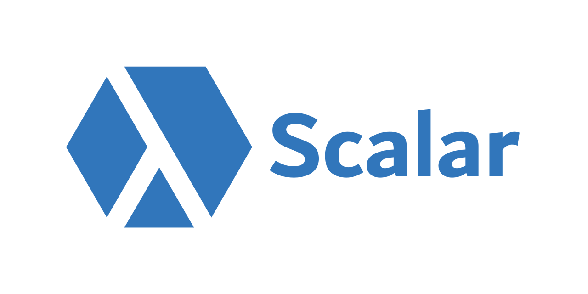

## What is Scalar?

Scalar is a tool that helps Git scale to some of the largest Git repositories.
It achieves this by enabling some advanced Git features, such as:

* *Partial clone:* reduces time to get a working repository by not
  downloading all Git objects right away.

* *Background prefetch:* downloads Git object data from all remotes every
  hour, reducing the amount of time for foreground `git fetch` calls.

* *Sparse-checkout:* limits the size of your working directory.

* *File system monitor:* tracks the recently modified files and eliminates
  the need for Git to scan the entire worktree.

* *Commit-graph:* accelerates commit walks and reachability calculations,
   speeding up commands like `git log`.

* *Multi-pack-index:* enables fast object lookups across many pack-files.

* *Incremental repack:* Repacks the packed Git data into fewer pack-file
  without disrupting concurrent commands by using the multi-pack-index.

As new versions of Git are released, we update the list of features that
Scalar automatically configures. This reduces your effort to keep your
repositories as efficient as possible.

## Scalar has moved!

Through significant effort from our team, we have successfully transitioned
Scalar from a modified version of [VFS for Git][vfsforgit] into a thin shell
around core Git features. The Scalar executable has now been ported to be
included [in the `microsoft/git` fork][microsoft-git]. Please visit that
fork for all of your Scalar needs:

* Download [the latest `microsoft/git` release][releases].
* Read [the Scalar documentation][docs].
* Contribute changes [to the `scalar` CLI][scalar-cli].

### Why did Scalar move?

Scalar started as a modification of [VFS for Git][vfsforgit] to
create a working solution with a robust test suite in a short amount of
time. The goal was to depend more on features that exist within Git itself
instead of creating new functionality within this project. Since the start,
we have focused on this goal with efforts such as
[improving sparse-checkout performance in Git][sparse-checkout-blog],
[implementing background maintenance in Git][background-maintenance],
and [integrating the GVFS protocol into `microsoft/git`][remove-read-object]
which allowed us to [drop the `Scalar.Mount` process][remove-mount].
All of these changes reduced the size of the code in Scalar itself until
it could be replaced [with a small command-line interface][scalar-cli].

[sparse-checkout-blog]: https://github.blog/2020-01-17-bring-your-monorepo-down-to-size-with-sparse-checkout/
[background-maintenance]: https://github.blog/2021-03-15-highlights-from-git-2-31/#introducing-git-maintenance
[remove-read-object]: https://github.com/microsoft/scalar/pull/122
[remove-mount]: https://github.com/microsoft/scalar/pull/222

Additional benefits to this change include making our release and
installation mechanism much simpler. Users now only need to install one
tool, not multiple, to take advantage of all of the benefits.

### What remains in this repository?

We are keeping the `microsoft/scalar` repository available since we have
linked to it and want to make sure those links continue to work. We
added pointers in several places to navigate readers to the `microsoft/git`
repository for the latest versions.

We also have a large set of functional tests that verify that Scalar
enlistments continue to work in a variety of advanced Git scenarios. These
tests are incredibly helpful as we advance features in `microsoft/git`, so
those tests remain in this repository. We run them as part of pull request
validation in `microsoft/git`, so no changes are made there without passing
this suite of tests.

### What if I already installed Scalar and want the new version?

We are working to ensure that users on the .NET version of Scalar have a
painless experience while changing to the new version.

* On Windows, users can [install `microsoft/git`][windows-install] and the
  installer will remove the .NET version and update any registered
  enlistments to work with the new version.

* On macOS, users should run `brew uninstall --cask scalar` or
  `brew uninstall --cask scalar-azrepos` depending on their version and
  then run `brew install --cask microsoft-git` to get the new version.
  At the moment, users on macOS will need to re-run `scalar register`
  on their enlistments to ensure they are registered for future upgrades.

* On Linux, there is no established uninstall mechanism, but the .NET
  version can be removed via `sudo rm -rf /usr/local/lib/scalar/`. Installing
  the new version will overwrite the `scalar` binary in `/usr/local/bin`.
  At the moment, users on Linux will need to re-run `scalar register`
  on their enlistments to ensure they are registered for future upgrades.

You can check if the new Scalar version is installed correctly by running
`scalar version` which should have the same output as `git version`.

## License

The Scalar source code in this repo is available under the MIT license. See [License.md](License.md).

## Code of Conduct

This project has adopted the [Microsoft Open Source Code of Conduct][conduct-code].
For more information see the [Code of Conduct FAQ][conduct-FAQ] or contact [opencode@microsoft.com][conduct-email] with any additional questions or comments.

[vfsforgit]: https://github.com/microsoft/vfsforgit
[microsoft-git]: https://github.com/microsoft/git
[releases]: https://github.com/microsoft/git/releases
[windows-install]: https://github.com/microsoft/git#windows
[docs]: https://github.com/microsoft/git/blob/HEAD/contrib/scalar/docs/index.md
[scalar-cli]: https://github.com/microsoft/git/blob/HEAD/contrib/scalar/scalar.c
[conduct-code]: https://opensource.microsoft.com/codeofconduct/
[conduct-FAQ]: https://opensource.microsoft.com/codeofconduct/faq/
[conduct-email]: mailto:opencode@microsoft.com
